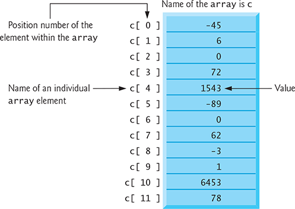
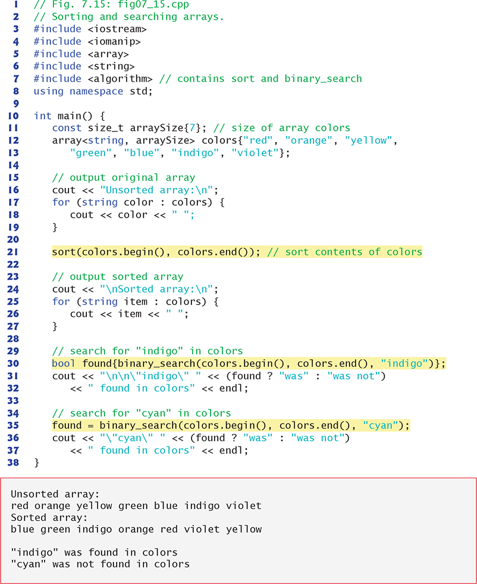
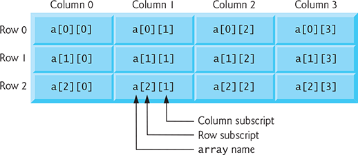
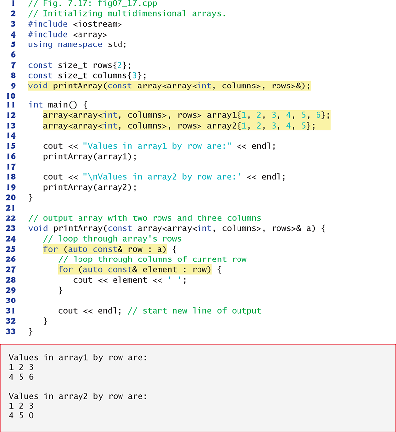

# Estructura de Datos
- [Arreglos / Vectores](#arreglos---vectores)
  * [Declarando arreglos](#declarando-arreglos)
  * [Declarando arreglos y usandolos en un ciclo](#declarando-arreglos-y-usandolos-en-un-ciclo)
  * [Declarando arreglos con una lista de inicialización](#declarando-arreglos-con-una-lista-de-inicializaci-n)
  * [Definiendo arreglos con un tamaño definido](#definiendo-arreglos-con-un-tama-o-definido)
  * [Sumando elementos en un arreglo](#sumando-elementos-en-un-arreglo)
  * [Estáticos vs Automáticos](#est-ticos-vs-autom-ticos)
  * [Modificar arreglos](#modificar-arreglos)
- [Ordenar y buscar arregos](#ordenar-y-buscar-arregos)
  * [Ordenar](#ordenar)
  * [Buscar](#buscar)
  * [Demostrando las funciones `sort`  y `binary_search`](#demostrando-las-funciones--sort---y--binary-search-)
- [Arreglos multidimensionales (Matrices)](#arreglos-multidimensionales--matrices-)

## Arreglos / Vectores

Un arreglo es un grupo contiguo de ubicaciones de memoria que tienen el mismo tipo. Para referirnos a una ubicación o elemento particular en el arreglo, especificamos el nombre del arreglo y el número de posición del elemento particular en el arreglo.

Un arreglo llamado c que contiene 12 elementos. Se hace referencia a cualquiera de estos elementos dando el nombre del arreglo seguido del número de posición del elemento particular entre corchetes ([ ]). El número de posición se denomina más formalmente subíndice o índice (este número especifica el número de elementos desde el comienzo del arreglo). El primer elemento tiene subíndice 0 (cero) y a veces se le llama el elemento cero. Por lo tanto, los elementos del arreglo c son c [0] (pronunciado "c sub cero"), c [1], c [2] y así sucesivamente. El subíndice más alto en el arreglo c es 11, que es 1 menos que el número de elementos en el arreglo (12).



### Declarando arreglos

Lo arreglos ocupan espacio en la memoria. Para especificar el tipo de elementos y la cantidad de elementos requeridos por un arreglo, use una declaración del formulario

`array<type, arraySize> arrayName;`

Ejemplo:

```c++
array<int, 12> c; // c is an array of 12 int values
```

### Declarando arreglos y usandolos en un ciclo

```c++
#include <iomanip>
#include <iostream>
int main(int argc, const char *argv[]) {
    int n[10];

    for (int i = 0; i < 10; ++i) {
        n[i] = 0;
    }

    std::cout << "Element" << std::setw(13) << "Value" << std::endl;

    for (int i = 0; i < 10; ++i) {
        std::cout << std::setw(7) << i << std::setw(13) << n[i] << std::endl;
    }
    return 0;
}
```

### Declarando arreglos con una lista de inicialización

```c++
#include <iomanip>
#include <iostream>

int main(int argc, const char *argv[]) {
    int n[10] = {32, 27, 64, 18, 95, 14, 90, 70, 60, 37};

    std::cout << "Element" << std::setw(13) << "Value" << std::endl;

    for (int i = 0; i < 10; ++i) {
        std::cout << std::setw(7) << i << std::setw(13) << n[i] << std::endl;
    }
    return 0;
}
```

### Definiendo arreglos con un tamaño definido

```c++
#include <iomanip>
#include <iostream>

int main(int argc, const char *argv[]) {
    const int arraySize = 10;

    int s[arraySize];

    for (int i = 0; i < arraySize; ++i) {
        s[i] = 2 + 2 * i;
    }

    std::cout << "Element" << std::setw(13) << "Value" << std::endl;

    for (int i = 0; i < arraySize; ++i) {
        std::cout << std::setw(7) << i << std::setw(13) << s[i] << std::endl;
    }
    return 0;
}
```

### Sumando elementos en un arreglo

```c++
#include <iostream>

int main(int argc, const char *argv[]) {
    const int arraySize = 10;

    int a[arraySize] = {87, 68, 94, 100, 83, 78, 85, 91, 76, 87};
    int total = 0;

    for (int i = 0; i < arraySize; ++i) {
        total += a[i];
    }

    std::cout << "Total of array elements: " << total << std::endl;
    return 0;
}
```

### Estáticos vs Automáticos

```c++
#include <iostream>

void staticArrayInit(void);
void automaticArrayInit(void);

const int arraySize = 3;

int main(int argc, const char *argv[]) {
    std::cout << "First call to each function:\n";
    staticArrayInit();
    automaticArrayInit();

    std::cout << "\n\nSecond call to each function:\n";
    staticArrayInit();
    automaticArrayInit();

    std::cout << std::endl;
    return 0;
}
// function to demonstrate a static local array
void staticArrayInit(void) {
    // initialises elements from 0 first time function is called
    static int array1[arraySize];

    std::cout << "\nValues on entering staticArrayInit:\n";

    // output contents of array1
    for (int i = 0; i < arraySize; ++i) {
        std::cout << "array1[" << i << "] = " << array1[i] << " ";
    }

    std::cout << "\nValues on exiting staticArrayInit:\n";

    // modify and ouput contents of array1
    for (int i = 0; i < arraySize; ++i) {
        std::cout << "array1[" << i << "] = " << (array1[i] += 5) << " ";
    }
}
// function to demonstrate an automatic local array
void automaticArrayInit(void) {
    // initialises elements each time function is called
    int array2[arraySize] = {1, 2, 3};

    std::cout << "\n\nValues on entering automaticArrayInit:\n";

    // output contents of array2
    for (int i = 0; i < arraySize; ++i) {
        std::cout << "array2[" << i << "] = " << array2[i] << " ";
    }

    std::cout << "\nValues on exiting automaticArrayInit:\n";

    // modify and output contents of array2
    for (int i = 0; i < arraySize; ++i) {
        std::cout << "array2[" << i << "] = " << (array2[i] += 5) << " ";
    }
}
```

### Modificar arreglos

```c++
#include <iomanip>
#include <iostream>

void modifyArray(int[], int);
void modifyElement(int);

int main(int argc, const char *argv[]) {
    const int arraySize = 5;
    int a[arraySize] = {0, 1, 2, 3, 4};

    std::cout << "Effects of passing entire array by reference:"
              << "\nThe values of the original array are:\n";

    for (int i = 0; i < arraySize; ++i) {
        std::cout << std::setw(3) << a[i];
    }

    std::cout << std::endl;

    // pass array a to modifyArray by reference
    modifyArray(a, arraySize);

    std::cout << "The values of the modified array are:\n";

    for (int i = 0; i < arraySize; ++i) {
        std::cout << std::setw(3) << a[i];
    }

    std::cout << "\n\nEffects of passing array element by value:"
              << "\na[3] before modifyElement: " << a[3] << std::endl;

    modifyElement(a[3]);

    std::cout << "a[3] after modifyElement: " << a[3] << std::endl;
    return 0;
}
// in function modifyArray, "b" points to the original array "a" in memory
void modifyArray(int b[], int sizeOfArray) {
    // multiply each array element by 2
    for (int k = 0; k < sizeOfArray; ++k) {
        b[k] *= 2;
    }
}
// in funciton modifyElement, "e" is a local copy of array element a[3] passed
// from main
void modifyElement(int e) {
    std::cout << "Value of element in modifyElement: " << (e *= 2) << std::endl;
}
```

## Ordenar y buscar arregos

### Ordenar

La clasificación de datos (su ubicación en orden ascendente o descendente) es una de las aplicaciones informáticas más importantes. Un banco clasifica todos los cheques por número de cuenta para que pueda preparar extractos bancarios individuales al final de cada mes. Las compañías telefónicas clasifican sus directorios telefónicos por apellido, y dentro de todas las entradas con el mismo apellido, clasifíquelos por nombre, para que sea más fácil encontrar números telefónicos. 

### Buscar

A menudo puede ser necesario determinar si arreglo contiene un valor que coincide con un cierto valor clave. El proceso de encontrar un elemento particular de un arreglo se llama búsqueda. 

### Demostrando las funciones `sort`  y `binary_search`



## Arreglos multidimensionales (Matrices)



