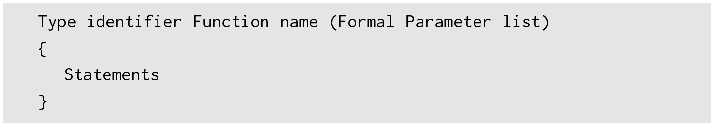
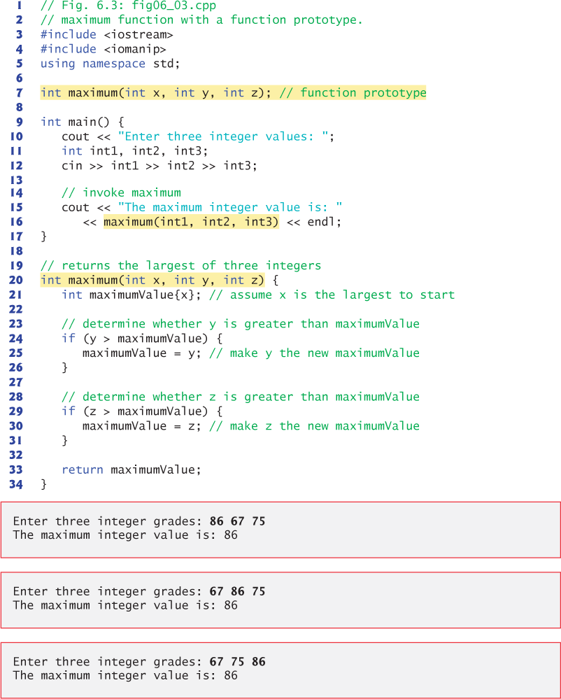
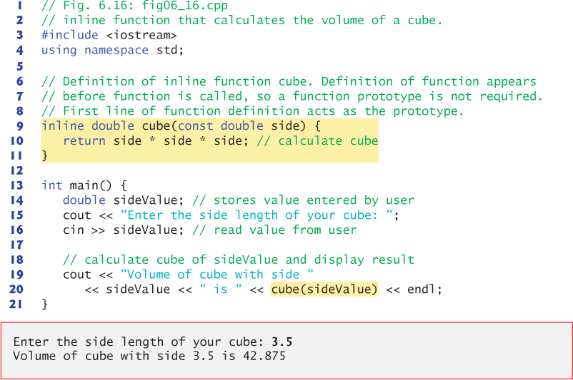
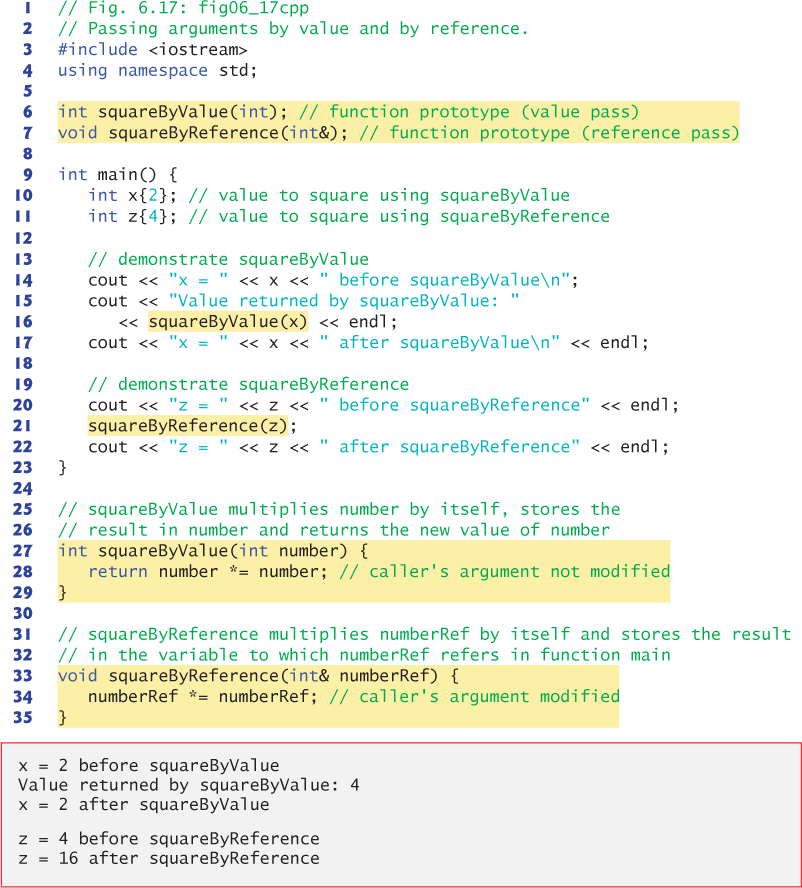
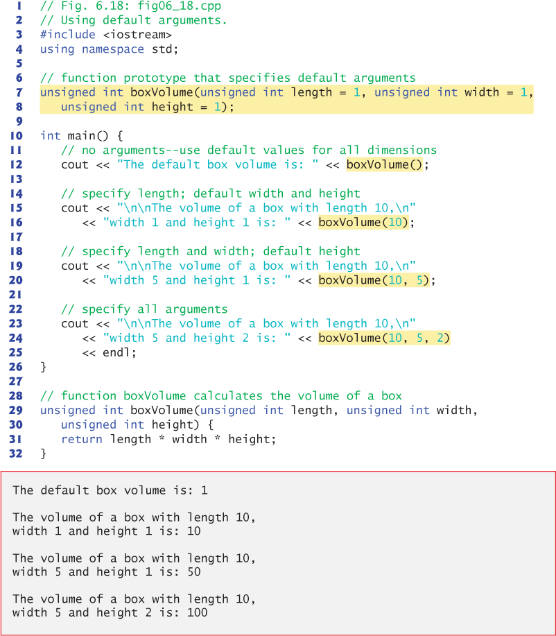
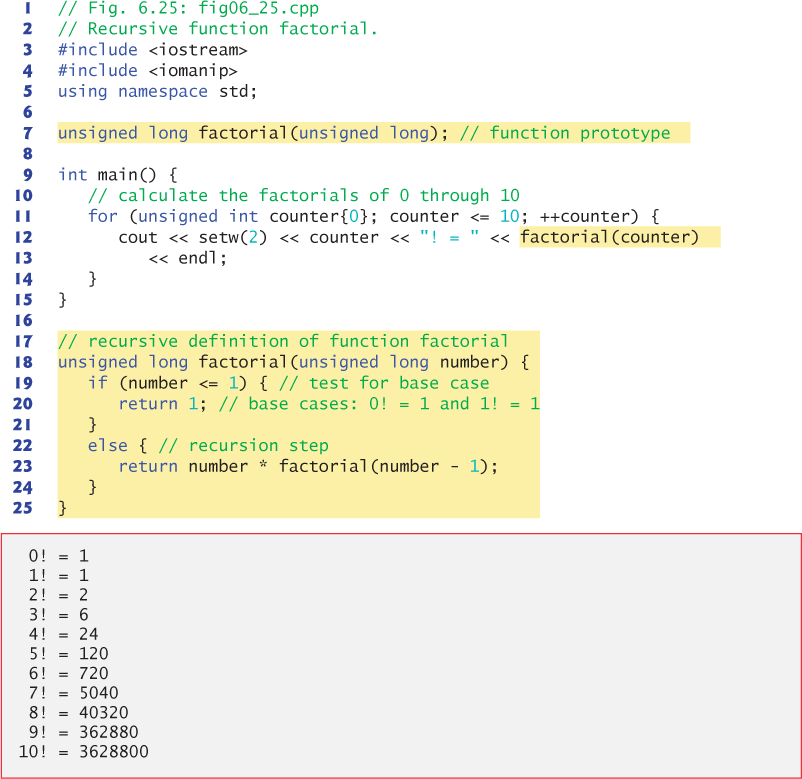

# Funciones

- [Definición y uso de la función](#definici-n-y-uso-de-la-funci-n)
- [Programación por componentes](#programaci-n-por-componentes)
- [Funciones prototipo](#funciones-prototipo)
- [Biblioteca estándar de C ++](#biblioteca-est-ndar-de-c---)
- [Funciones *InLine*](#funciones--inline-)
- [Referencias y parámetros de referencia](#referencias-y-par-metros-de-referencia)
- [Argumentos por *Default*](#argumentos-por--default-)
- [Recursividad](#recursividad)
  * [Conceptos de recursión](#conceptos-de-recursi-n)

**C ++** hereda toda la sintaxis de C, incluida la definición y el uso de funciones. En la programación orientada a procesos (también conocida como programación estructurada), la función es la unidad básica de división de módulos y un resumen del proceso de resolución de problemas. La función también es importante en la programación orientada a objetos, en la que es un resumen de funcionalidades.

## Definición y uso de la función

Un programa C ++ consta de una función principal y varias subfunciones. Un programa se ejecuta a partir de su función principal. La función principal puede llamar a subfunciones, y las subfunciones a su vez pueden llamar a otras subfunciones.

## Programación por componentes

Los programas C ++ generalmente se escriben combinando funciones y clases "preempaquetadas" disponibles en la Biblioteca estándar de C ++ con nuevas funciones y clases que usted escribe. La biblioteca estándar de C ++ proporciona una rica colección de funciones para cálculos matemáticos comunes, manipulaciones de cadenas, manipulaciones de caracteres, entrada / salida, verificación de errores y muchas otras operaciones útiles.

Existen varias motivaciones para modularizar un programa con funciones:

> - Reutilización de software. Por ejemplo, en programas anteriores, no teníamos que definir cómo leer una línea de texto desde el teclado: C ++ proporciona esta capacidad a través de la función getline del encabezado <string>.
>
> - Evitar la repetición de código.
>
> - Dividir un programa en funciones significativas hace que el programa sea más fácil de probar, depurar y mantener.

## Funciones prototipo

Este es un prototipo de función, que describe la función máxima sin revelar su implementación. Un prototipo de función es una declaración de una función que le dice al compilador el nombre de la función, su tipo de retorno y los tipos de sus parámetros. 

Este prototipo de función indica que la función devuelve un `int`, tiene el nombre máximo y requiere tres parámetros int para realizar su tarea. Observe que el prototipo de la función es el mismo que la primera línea de la definición de la función correspondiente (línea 20), pero termina con un punto y coma requerido.

## Biblioteca estándar de C ++

| Standard Library header                                      | Explanation                                                  |
| :----------------------------------------------------------- | :----------------------------------------------------------- |
| `<iostream>`                                                 | Contains function prototypes for the C++ standard input and output functions. |
| `<iomanip>`                                                  | Contains function prototypes for stream manipulators that format streams of data. |
| `<cmath>`                                                    | Contains function prototypes for math library functions.     |
| `<cstdlib>`                                                  | Contains function prototypes for conversions of numbers to text, text to numbers, memory allocation, random numbers and various other utility functions. |
| `<ctime>`                                                    | Contains function prototypes and types for manipulating the time and date. |
| `<array>`, `<vector>`, `<list>`, `<forward_list>`, `<deque>`, `<queue>`, `<stack>`, `<map>`, `<unordered_map>`, `<unordered_set>`, `<set>`, `<bitset>` | These headers contain classes that implement the C++ Standard Library containers. Containers store data during a program’s execution. |
| `<cctype>`                                                   | Contains function prototypes for functions that test characters for certain properties (such as whether the character is a digit or a punctuation), and function prototypes for functions that can be used to convert lowercase letters to uppercase letters and vice versa. |
| `<cstring>`                                                  | Contains function prototypes for C-style string-processing functions. |
| `<typeinfo>`                                                 | Contains classes for runtime type identification (determining data types at execution time). |
| `<exception>`, `<stdexcept>`                                 | These headers contain classes that are used for exception handling. |
| `<memory>`                                                   | Contains classes and functions used by the C++ Standard Library to allocate memory to the C++ Standard Library containers. |
| `<fstream>`                                                  | Contains function prototypes for functions that perform input from and output to files on disk. |
| `<string>`                                                   | Contains the definition of class `string` from the C++ Standard Library. |
| `<sstream>`                                                  | Contains function prototypes for functions that perform input from strings in memory and output to strings in memory. |
| `<functional>`                                               | Contains classes and functions used by C++ Standard Library algorithms. |
| `<iterator>`                                                 | Contains classes for accessing data in the C++ Standard Library containers. |
| `<algorithm>`                                                | Contains functions for manipulating data in C++ Standard Library containers. |
| `<cassert>`                                                  | Contains macros for adding diagnostics that aid program debugging. |
| `<cfloat>`                                                   | Contains the floating-point size limits of the system.       |
| `<climits>`                                                  | Contains the integral size limits of the system.             |
| `<cstdio>`                                                   | Contains function prototypes for the C-style standard input/output library functions. |
| `<locale>`                                                   | Contains classes and functions normally used by stream processing to process data in the natural form for different languages (e.g., monetary formats, sorting strings, character presentation, etc.). |
| `<limits>`                                                   | Contains classes for defining the numerical data type limits on each computer platform—this is C++’s version of `<climits>` and `<cfloat>`. |
| `<utility>`                                                  | Contains classes and functions that are used by many C++ Standard Library headers. |

## Funciones *InLine*

## Referencias y parámetros de referencia

Dos formas de pasar argumentos a funciones en muchos lenguajes de programación son pasar por valor y pasar por referencia. Cuando se pasa un argumento por valor, se realiza una copia del valor del argumento y se pasa (en la pila de llamadas a funciones) a la función llamada. Los cambios en la copia no afectan el valor de la variable original en la persona que llama. Esto evita los efectos secundarios accidentales que dificultan en gran medida el desarrollo de sistemas de software correctos y confiables. 

## Argumentos por *Default*

Es común que un programa invoque una función repetidamente con el mismo valor de argumento para un parámetro en particular. En tales casos, puede especificar que dicho parámetro tenga un argumento predeterminado, es decir, un valor predeterminado que se pasará a ese parámetro. Cuando un programa omite un argumento para un parámetro con un argumento predeterminado en una llamada a la función, el compilador reescribe la llamada a la función e inserta el valor predeterminado de ese argumento.

## Recursividad

Para algunos problemas, es útil que las funciones se llamen a sí mismas. **Una función recursiva es una función que se llama a sí misma**, ya sea directa o indirectamente (a través de otra función). 

> El documento estándar de C ++ indica que no se debe llamar a main dentro de un programa o de forma recursiva. Su único propósito es ser el punto de partida para la ejecución del programa.

### Conceptos de recursión

Los enfoques de resolución de problemas recursivos tienen una serie de elementos en común. 

- Se llama a una función recursiva para resolver un problema. 
- La función sabe cómo resolver solo los casos más simples, o los llamados casos base. 
- Si la función se llama con un caso base, la función simplemente devuelve un resultado. 
- Si la función se llama con un problema más complejo, generalmente divide el problema en dos partes conceptuales: una parte que la función sabe cómo hacer y una parte que no sabe cómo hacer. 
- Para que la recursividad sea factible, la última pieza debe parecerse al problema original, pero debe ser una versión un poco más simple o más pequeña. 
- Este nuevo problema se parece al original, por lo que la función llama una copia de sí mismo para trabajar en el problema más pequeño; esto se conoce como una llamada recursiva y también se denomina paso de recursión. 
- El paso de recursión a menudo incluye el retorno de la palabra clave, porque su resultado se combinará con la parte del problema que la función supo resolver para formar el resultado pasado al llamador original, posiblemente principal.

