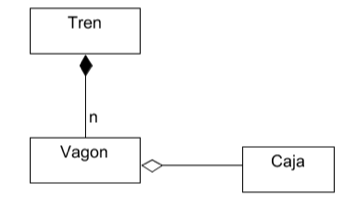
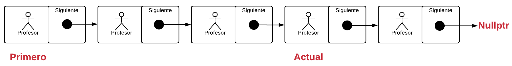

# Listas Simples Enlazadas

Una estructura de punteros enlazada entre sí, es muy similar a un vector con la ventaja que no se limita a un tamaño en específico.

Esta estructura de datos es valiosa para las situaciones en las que el volumen de datos se puede incrementar o decrementar dinámicamente durante la ejecución del programa. 

Para entender listas enlazadas, usaremos como analogía un tren, el cual típicamente está compuesto por una serie de vagones. Un tren realmente no tiene un tamaño definido pues en cualquier momento se pueden enganchar o desenganchar vagones haciendo esto cambiar su tamaño. Un tren es por tanto una colección de vagones, en donde cada uno de los cuales tiene dos partes importantes: 

- Un enganche al próximo vagón 
- Un elemento que transporta (en el caso de la imagen una caja).

Cuando creamos una colección tipo lista, esta debe tener dos clases básicas: 

- Clase Lista (seria como el tren)

- Clase Nodo (seria como el vagón)

Una lista enlazada es simplemente una serie de objetos llamados Nodos enlazados con punteros.

Para realizar una lista necesitamos como mínimo, una clase **Nodo** y una clase **lista**, además del elemento propio que queramos colocar dentro de la lista, en este caso profesores:

 La clase **Nodo**viene siendo como el vagón de un tren, el cual se entrelaza con otro vagón al tiempo que transporte un valor o un contenido en su interior. 

La clase **Nodo** tiene como objetivo es encapsular:

- Un puntero a otro `Nodo`, generalmente se le llama `siguiente`.
- El contenido al objeto principal

## Características de las listas enlazadas:

- Son una secuencia “conectada” de nodos.
- Tienen un nodo inicial (frente o cabeza) y un nodo final (cola).
- Cada nodo almacena (al menos) dos valores: un valor o contenido de la lista y un *puntero*o *referencia*que indica la posición del nodo que contiene el siguiente valor de la lista. 
- Para que un nodo pueda acceder al siguiente y la lista no se *rompa*cada nodo tiene que tener un puntero que guarde la dirección de memoria que ocupa el siguiente elemento.
- Solo puede ser recorrida en forma secuencial.
- Nunca debemos soltar el inicio de la lista, para ello generalmente declaramos un puntero llamado primero o inicio.
- El ultimo nodo siempre debe tener un puntero  a `nullptr`
- Cuando aplicamos restricciones de acceso a las listas tenemos pilas y colas,  que son listas especiales.
- Las listas son una estructura de datos más general que las colas y las pilas, por lo que se puede decir que éstas últimas son casos particulares de las listas.

------

[Página de Inicio](https://github.com/mikeguzman/EIF201-Progra-I)

