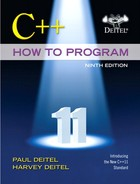

# Material de referencia

l siguiente material se va a presentar tanto en español como en ingles, y es la guía principal para desarrollar el curso.

## Sistema de Control de Versiones

Git (pronunciado "guit"2​) es un software de control de versiones diseñado por Linus Torvalds, pensando en la eficiencia y la confiabilidad del mantenimiento de versiones de aplicaciones cuando éstas tienen un gran número de archivos de código fuente. Su propósito es llevar registro de los cambios en archivos de computadora y coordinar el trabajo que varias personas realizan sobre archivos compartidos.

- [Definición de Git en Wikipedia](https://es.wikipedia.org/wiki/Git)
- [Sitio oficial de Git](https://git-scm.com/)
- [Tutorial básico de Git en español](https://rogerdudler.github.io/git-guide/index.es.html)
- [Sitio de GitHub](https://github.com/)
- [Descargar el cliente de GitHub](https://desktop.github.com/)

## Programando en C++

1. Instalar las librerias de C++
   - [MinGW](http://www.mingw.org/)
   - [GNU C++](gcc.gnu.org/install/binaries.html)
2. Editores de código recomendados para este curso
   - [Clion](https://www.jetbrains.com/clion/) *Gratis con el email @una.cr* y **el recomendado del curso**
   - [Microsoft Visual Studio Code](https://code.visualstudio.com/)
     - [Configuración para Windows]()
     - [Configuración para Mac](https://code.visualstudio.com/docs/cpp/config-clang-mac)
   - [Netbeans](https://netbeans.org/features/cpp/)
   - [Eclipse](https://www.eclipse.org/downloads/packages/release/luna/r/eclipse-ide-cc-developers)

## Pruebas unitarias para C++ *Unit Testing*

Porciones de código diseñados para comprobar que el código principal está funcionando como esperábamos.

- [Catch 2](https://github.com/catchorg/Catch2)

## Reglas importantes

- [Normas de programación](http://cppunit.sourceforge.net/cppunit2/doc/coding_guidelines.html) 

## Herramientas importantes

- UML
  - [https://www.lucidchart.com](https://www.lucidchart.com/)
- Sites
  - [https://www.wolframalpha.com](https://www.wolframalpha.com/) (Para revisar cálculos matemáticos y otras cosas)
- Clion
  - https://www.jetbrains.com/help/clion/generatinng-defenitions.html

## Libros y información de referencia

 C++ How to Program, Ninth Edition

by [Harvey Deitel](https://learning.oreilly.com/search/?query=author%3A"Harvey Deitel"&sort=relevance&highlight=true), [Paul Deitel](https://learning.oreilly.com/search/?query=author%3A"Paul Deitel"&sort=relevance&highlight=true)

Publisher: [Prentice Hall](https://learning.oreilly.com/library/publisher/prentice-hall/)

Release Date: February 2013

ISBN: 9780133378719

---

[Página de Inicio](https://github.com/mikeguzman/EIF201-Progra-I)