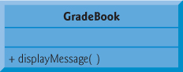
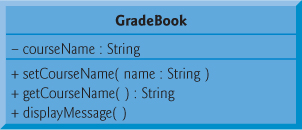

# Clases y objetos

- [Especificaciones de acceso](#especificaciones-de-acceso)
- [Diagrama de UML](#diagrama-de-uml)
- [Funciones *GET*, *SET* y de *DATA*](#funciones--get----set--y-de--data-)
  + [Data-member](#data-member)
  + [SET members](#set-members)
  + [GET members](#get-members)

---

La definición de una clase inicia con la palabra reservada ```class``` seguida del nombre de la clase, por convención el nombre de la clase siempre empieza con mayúscula, cada parabra subsecuente también empieza con mayúscula, ejemplo: ```GradeBook```.

[Normas de programación](http://cppunit.sourceforge.net/cppunit2/doc/coding_guidelines.html)

## Especificaciones de acceso

| Palabra Clave   | Descripción                                                  |
| --------------- | ------------------------------------------------------------ |
| ```public```    | Todos tienen acceso                                          |
| ```protected``` | Sólo la clase en sí, las clases derivadas y los amigos tienen acceso. |
| ```private```   | Sólo la clase en sí y los amigos tienen acceso.              |

Cuando el tipo se define con la palabra clave de `class` , el especificador de acceso predeterminado es `private` , pero si el tipo se define con la palabra clave `struct` , el especificador de acceso predeterminado es `public` :

```c++
struct MyStruct { int x; };
class MyClass { int x; };

MyStruct s;
s.x = 9; // well formed, because x is public

MyClass c;
c.x = 9; // ill-formed, because x is private
```

## Diagrama de UML

> Es un lenguaje gráfico para visualizar, especificar, construir y documentar un sistema. UML ofrece un estándar para describir un "plano" del sistema (modelo), incluyendo aspectos conceptuales tales como procesos, funciones del sistema, y aspectos concretos como expresiones de lenguajes de programación, esquemas de bases de datos y compuestos reciclados. [Wiki](https://es.wikipedia.org/wiki/Lenguaje_unificado_de_modelado)

Ejemplo de [myfirstclass.cpp](../examples/01_intro_objects/01/myfirstclass.cpp):



## Funciones *GET*, *SET* y *DATA*

Al crear una clase definimos una parte pública y una parte privada, por lo que estos métodos ya dichos,  son **métodos de acceso**, lo que significa que generalmente son una interfaz pública para cambiar miembros de las clases privadas.

Los métodos `getter` y `setter` se utilizan para definir una propiedad, a estos se accede como propiedades situadas fuera de la clase, aunque las defina dentro de la clase como métodos.

```c++
class GradeBook {
 private:
    std::string courseName;

 public:
    // SETTERS
    void setCourseName(const std::string &name) { courseName = name; }
    // GETTERS
    std::string getCourseName() { return courseName; }
    // function that displays a welcome message
    void displayMessage() {
        // this statement calls getCourseName to get the name of the course
        // this GradeBook represents
        std::cout << "Welcome to the grade book for\n"
                  << getCourseName() << "!" << std::endl;
    }
};
```

### Data member

La mayoría de declaraciones van despues de modificador de acceso

```c++
 private:
    std::string courseName;
```

### SET member

Sirve para asignar un valor inicial a un atributo, pero de forma explícita,  y solo nos permite dar acceso público a ciertos atributos que deseemos el usuario pueda modificar. Es decir permiten cambiar el valor de los atributos.

```c++
public:
    // SETTERS
    void setCourseName(const std::string &name) { courseName = name; }
		...
```

### GET member

Sirve para obtener (recuperar o acceder) el valor ya asignado a un atributo y utilizarlo para cierto método.

```c++
public:
    ...
    // GETTERS
    std::string getCourseName() { return courseName; }
```

### Member Function ***displayMessage***

No retorna ningun dato, por eso es `void` pero permite mostrar el contenido de la clase. 

```c++
public:
    ...
    // function that displays a welcome message
    void displayMessage() {
        // this statement calls getCourseName to get the name of the course
        // this GradeBook represents
        std::cout << "Welcome to the grade book for\n"
                  << getCourseName() << "!" << std::endl;
    }
```

### Example and UML

[example_getset.cpp](../examples/03_class/01/example_getset.cpp) Define class GradeBook that contains a courseName data member and member functions to set and get its value; Create and manipulate a GradeBook object with theses functions.



---

[Página de Inicio](https://github.com/mikeguzman/EIF201-Progra-I)