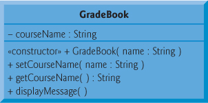
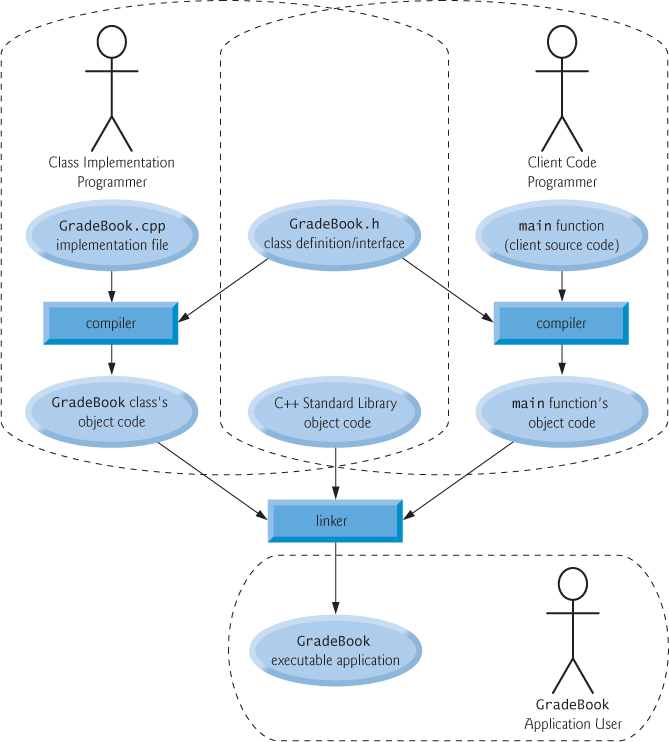

# Clases y objetos
- [Modificadores de acceso](#modificadores-de-acceso)
- [Diagrama de UML](#diagrama-de-uml)
- [Funciones *GET*, *SET* y *member*](#funciones--get----set--y--member-)
  * [Data member](#data-member)
  * [SET member](#set-member)
  * [GET member](#get-member)
  * [Member ***displayMessage***](#member----displaymessage---)
  * [Ejemplo de get y set](#ejemplo-de-get-y-set)
- [Inicializando objetos y constructores](#inicializando-objetos-y-constructores)
  * [Constructores](#constructores)
  * [Ejemplo de constructor básico](#ejemplo-de-constructor-b-sico)
- [Constructores *Default*](#constructores--default-)
- [Colocar una clase en archivos separados para reutilizarse](#colocar-una-clase-en-archivos-separados-para-reutilizarse)
  * [Headers](#headers)
  * [Ejemplo de archivos separados](#ejemplo-de-archivos-separados)
    + [GradeBook.h](#gradebookh)
    + [GradeBook.cpp](#gradebookcpp)
- [Separar la interfaz de la aplicación](#separar-la-interfaz-de-la-aplicaci-n)
  * [La interfaz de una clase](#la-interfaz-de-una-clase)
  * [Ejemplo separación de la interfaz de la implementación](#ejemplo-separaci-n-de-la-interfaz-de-la-implementaci-n)
    + [GradeBook.h](#gradebookh-1)
    + [GradeBook.cpp](#gradebookcpp-1)
    + [MainAppInterface.cpp](#mainappinterfacecpp)
    + [Diagrama](#diagrama)

---

La definición de una clase inicia con la palabra reservada ```class``` seguida del nombre de la clase, por convención el nombre de la clase siempre empieza con mayúscula, cada parabra subsecuente también empieza con mayúscula, ejemplo: ```GradeBook```.

[Normas de programación](http://cppunit.sourceforge.net/cppunit2/doc/coding_guidelines.html)

## Modificadores de acceso

| Palabra Clave   | Descripción                                                  |
| --------------- | ------------------------------------------------------------ |
| ```public```    | Todos tienen acceso                                          |
| ```protected``` | Sólo la clase en sí, las clases derivadas y los amigos tienen acceso. |
| ```private```   | Sólo la clase en sí y los amigos tienen acceso.              |

Cuando el tipo se define con la palabra clave de `class` , el especificador de acceso predeterminado es `private` , pero si el tipo se define con la palabra clave `struct` , el especificador de acceso predeterminado es `public` :

```c++
struct MyStruct { int x; };
class MyClass { int x; };

MyStruct s;
s.x = 9; // well formed, because x is public

MyClass c;
c.x = 9; // ill-formed, because x is private
```

## Diagrama de UML

> Es un lenguaje gráfico para visualizar, especificar, construir y documentar un sistema. UML ofrece un estándar para describir un "plano" del sistema (modelo), incluyendo aspectos conceptuales tales como procesos, funciones del sistema, y aspectos concretos como expresiones de lenguajes de programación, esquemas de bases de datos y compuestos reciclados. [Wiki](https://es.wikipedia.org/wiki/Lenguaje_unificado_de_modelado)

Ejemplo de [myfirstclass.cpp](../examples/01_intro_objects/01/myfirstclass.cpp):


## Funciones *GET*, *SET* y *member*

Al crear una clase definimos una parte pública y una parte privada, por lo que estos métodos ya dichos,  son **métodos de acceso**, lo que significa que generalmente son una interfaz pública para cambiar miembros de las clases privadas.

Los métodos `getter` y `setter` se utilizan para definir una propiedad, a estos se accede como propiedades situadas fuera de la clase, aunque las defina dentro de la clase como métodos.

```c++
class GradeBook {
 private:
    std::string courseName;

 public:
    // SETTERS
    void setCourseName(const std::string &name) { courseName = name; }
    // GETTERS
    std::string getCourseName() { return courseName; }
    // function that displays a welcome message
    void displayMessage() {
        // this statement calls getCourseName to get the name of the course
        // this GradeBook represents
        std::cout << "Welcome to the grade book for\n"
                  << getCourseName() << "!" << std::endl;
    }
};
```

### Data member

La mayoría de declaraciones van despues de modificador de acceso

```c++
 private:
    std::string courseName;
```

### SET member

Sirve para asignar un valor inicial a un atributo, pero de forma explícita,  y solo nos permite dar acceso público a ciertos atributos que deseemos el usuario pueda modificar. Es decir permiten cambiar el valor de los atributos.

```c++
public:
    // SETTERS
    void setCourseName(const std::string &name) { courseName = name; }
		...
```

### GET member

Sirve para obtener (recuperar o acceder) el valor ya asignado a un atributo y utilizarlo para cierto método.

```c++
public:
    ...
    // GETTERS
    std::string getCourseName() { return courseName; }
```

### Member ***displayMessage***

No retorna ningun dato, por eso es `void` pero permite mostrar el contenido de la clase. 

```c++
public:
    ...
    // function that displays a welcome message
    void displayMessage() {
        // this statement calls getCourseName to get the name of the course
        // this GradeBook represents
        std::cout << "Welcome to the grade book for\n"
                  << getCourseName() << "!" << std::endl;
    }
```

### Ejemplo de get y set

[example_getset.cpp](../examples/03_class/01/example_getset.cpp) *define class GradeBook that contains a courseName data member and member functions to set and get its value; Create and manipulate a GradeBook object with theses functions.*


## Inicializando objetos y constructores

### Constructores

Los constructores son funciones miembro especiales que sirven para inicializar un objeto de una determinada clase al mismo tiempo que se declara.

Los constructores son especiales por varios motivos:

- Tienen el mismo nombre que la clase a la que pertenecen.
- No tienen tipo de retorno, y por lo tanto no retornan ningún valor.
- No pueden ser heredados.
- Por último, deben ser públicos, no tendría ningún sentido declarar un constructor como privado, ya que siempre se usan desde el exterior de la clase, ni tampoco como protegido, ya que no puede ser heredado.

```c++
 public:
    explicit GradeBook(const std::string &name) { setCourseName(name); }
```

Se declaró el constructor como `explicit` dado que sólo recibe un parámetro. 

> Se recomienda declarar todos los constructores de un único parámetro como `explicit`

### Ejemplo de constructor básico 

[exa_constructor.cpp](../examples/03_class/02/exa_constructor.cpp) *Instantiating multiple objects of the GradeBook class and using the GradeBook constructor to specify the course name when each GradeBook object is created.*



## Constructores *Default*

Cualquier constructor sin argumentos se llama constructor *default*. Una clase puede obtener un constructor *default* de la siguiente forma:

- El compilador implicitamente crea un constructor *default* en todas las clases que el usuario no haya definido uno
- El desarrollador explicitamente define un constructor *default* para definir algunas inicializaciones iniciales.
- Si el desarrollador define cualquier constructor con argumentos, C++ no necesariamente implicitamente crea un constructor *default*.

## Colocar una clase en archivos separados para reutilizarse

Una de las ventajas de crear definiciones de clase es que, cuando se empaqueta correctamente, otros programadores pueden reutilizar sus clases. Por ejemplo, puede reutilizar la Biblioteca estándar de C ++ de tipo `string` en cualquier programa de C ++ al incluir el encabezado `<string>`.

### Headers

Al crear un programa C ++ orientado a objetos, es habitual definir el código fuente reutilizable (como una clase) en un archivo que, por convención, tiene una extensión de nombre de archivo **.h**, conocida como *headers*.

Los programas usan directivas de preprocesamiento `#include` para incluir encabezados y aprovechar los componentes de software reutilizables.

### Ejemplo de archivos separados

#### GradeBook.h 

Código Fuente => [GradeBook.h](../examples/03_class/03/GradeBook.h)

```c++
#include <iostream>
#include <string>

// GradeBook class definition
class GradeBook {
 private:
    std::string courseName;

 public:
    explicit GradeBook(const std::string &name) { setCourseName(name); }
    // SETTERS
    void setCourseName(const std::string &name) { courseName = name; }
    // GETTERS
    std::string getCourseName() { return courseName; }
    // display a welcome message to the GradeBook user
    void displayMessage() {
        std::cout << "Welcome to the grade book for\n"
                  << getCourseName() << "!" << std::endl;
    }
};
```

#### GradeBook.cpp

Código Fuente => [GradeBook.cpp](../examples/03_class/03/GradeBook.cpp)

```c++
#include <iostream>
#include "GradeBook.h"

// function main begins program excution
int main(int argc, const char *argv[]) {
    // create two GradeBook objects
    GradeBook gradeBook1("CS101 Introduction to C++ Programming");
    GradeBook gradeBook2("Cs102 Data Structures in C++");

    // display initial value of courseName for each GradeBook
    std::cout << "gradeBook1 created for course: "
              << gradeBook1.getCourseName();
    std::cout << "\ngradeBook2 created for course: "
              << gradeBook2.getCourseName() << std::endl;
    return 0;
}
```

## Separar la interfaz de la aplicación

Separar la interfaz de la aplicación es un principio fundamental de la ingeniería de software.

### La interfaz de una clase

Las **interfaces** definen y estandarizan las formas en que cosas como las personas y los sistemas interactúan entre sí. Por ejemplo, los controles de una radio sirven como una interfaz entre los usuarios de la radio y sus componentes internos. Los controles permiten a los usuarios realizar un conjunto limitado de operaciones (como cambiar la estación, ajustar el volumen y elegir entre estaciones AM y FM). Varias radios pueden implementar estas operaciones de manera diferente: algunas proporcionan botones pulsadores, algunas proporcionan botones digitales y otras admiten comandos de voz. La interfaz especifica qué operaciones permite que los usuarios realicen una radio, pero no especifica cómo se implementan las operaciones dentro de la radio.

De manera similar, la **interfaz de una clase** describe qué servicios pueden usar los clientes de una clase y cómo solicitar esos servicios, pero no cómo la clase podría llevar a cabo los servicios. La interfaz pública de una clase consta de las funciones de miembro público de la clase (también conocidas como servicios públicos de la clase).

### Ejemplo separación de la interfaz de la implementación

#### GradeBook.h 

Código Fuente => [GradeBook.h](../examples/03_class/04/GradeBook.h)

```c++
#pragma once

#include <string>

class GradeBook {
 private:
    std::string courseName;

 public:
    explicit GradeBook(const std::string &);

    // SETTERS
    void setCourseName(const std::string &);

    // GETTERS
    std::string getCourseName();

    void displayMessage();
};
```

#### GradeBook.cpp

Código Fuente => [GradeBook.cpp](../examples/03_class/04/GradeBook.cpp)

```c++
#include "GradeBook.h"

#include <iostream>
#include <string>

// Constructor
GradeBook::GradeBook(const std::string &name) { setCourseName(name); }
// SETTERS
void GradeBook::setCourseName(const std::string &name) { courseName = name; }
// GETTERS
std::string GradeBook::getCourseName() { return courseName; }
// display a welcome message to the GradeBook user
void GradeBook::displayMessage() {
    std::cout << "Welcome to the grade book for\n"
              << getCourseName() << "!" << std::endl;
}
```

#### MainAppInterface.cpp

Código Fuente => [MainAppInterface.cpp](../examples/03_class/04/MainAppInterface.cpp)

```c++
#include <iostream>
#include "GradeBook.h"

int main(int argc, const char *argv[]) {
    GradeBook gradeBook1("CS101 Introduction to C++ Programming.");
    GradeBook gradeBook2("CS102 Data Structures in C++.");

    // display initial values of courseName for each GradeBook
    std::cout << "gradeBook1 created for course: "
              << gradeBook1.getCourseName();
    std::cout << "\ngradeBook2 created for course: "
              << gradeBook2.getCourseName() << std::endl;
    return 0;
}
```

#### Diagrama de interfaces



## Validación de datos con funciones ***SET***

Es un ejemplo interesante de como reutilizar las funciones *SET* para propósitos lógicos.

### Ejemplo de validaciones en los mátodos *SET*

#### GradeBook.h 

Código Fuente => [GradeBook.h](../examples/03_class/05/GradeBook.h)

```c++
#pragma once

#include <string>

class GradeBook {
 private:
    std::string courseName;

 public:
    explicit GradeBook(const std::string &);

    // SETTERS
    void setCourseName(const std::string &);

    // GETTERS
    std::string getCourseName();

    void displayMessage();
};
```

#### GradeBook.cpp

Código Fuente => [GradeBook.cpp](../examples/03_class/05/GradeBook.cpp)

```c++
#include "GradeBook.h"

#include <iostream>
#include <string>

GradeBook::GradeBook(const std::string &name) { setCourseName(name); }
// SETTERS
// ensure coursename does not exceed 25 chars
void GradeBook::setCourseName(const std::string &name) {
    if (name.length() <= 25) { courseName = name; }

    if (name.length() > 25) {
        courseName = name.substr(0, 25);

        std::cout << "Name \"" << name << "\" exceeds maximum length (25).\n";
        std::cout << "Limiting courseName to first 25 characters.\n"
                  << std::endl;
    }
}
// GETTERS
std::string GradeBook::getCourseName() { return courseName; }
// display a welcome message to the GradeBook user
void GradeBook::displayMessage() {
    std::cout << "Welcome to the grade book for\n"
              << getCourseName() << "!" << std::endl;
}
```

#### MainAppValidations.cpp

Código Fuente => [MainAppValidations.cpp](../examples/03_class/05/MainAppValidations.cpp)

```c++
#include <iostream>

#include "GradeBook.h"

int main(int argc, const char *argv[]) {
    GradeBook gradeBook1("CS101 Introduction to Programming in C++");
    GradeBook gradeBook2("CS102 C++ Data Structures");

    // display each GradeBook's courseName
    std::cout << "gradeBook1 initial course name: "
              << gradeBook1.getCourseName();
    std::cout << "\ngradeBook2 initial course name: "
              << gradeBook2.getCourseName() << std::endl;

    // modify myGradeBook's courseName (with a valid length string)
    gradeBook1.setCourseName("CS101 C++ Programming");

    // display each GradeBook's courseName
    std::cout << "\ngradeBook1 course name: " << gradeBook1.getCourseName();
    std::cout << "\ngradeBook2 course name: " << gradeBook2.getCourseName()
              << std::endl;
    return 0;
}
```

#### 

---

[Página de Inicio](https://github.com/mikeguzman/EIF201-Progra-I)