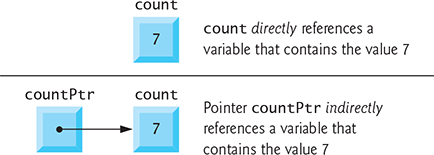
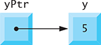
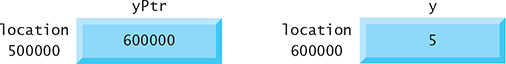
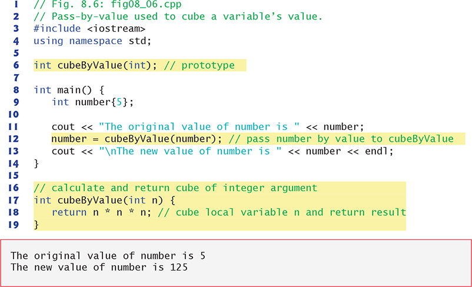
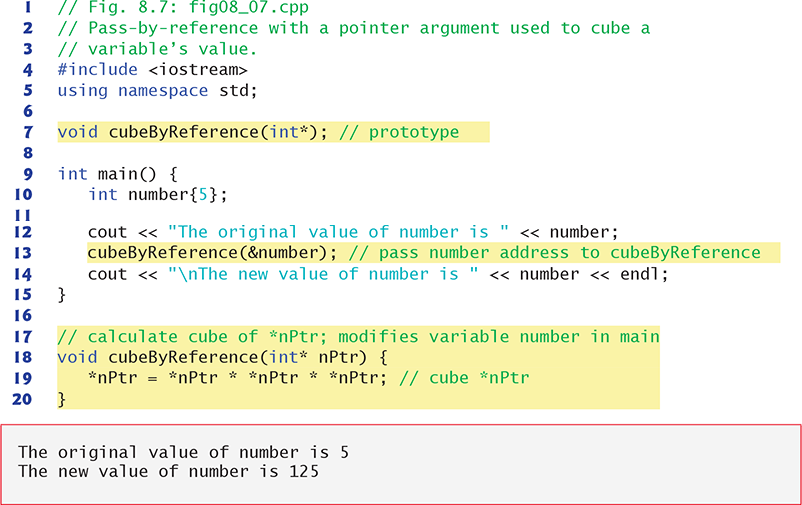

# Punteros

## Declaraciones e inicialización de variables de puntero

Las variables de puntero contienen direcciones de memoria como sus valores. Normalmente, una variable contiene directamente un valor específico. Un puntero contiene la **dirección de memoria de una variable que, a su vez, contiene un valor específico**. En este sentido, un nombre de variable hace referencia directa a un valor, y un puntero hace referencia indirectamente a un valor. Hacer referencia a un valor a través de un puntero se llama **indirección**. Los diagramas generalmente representan un puntero como una flecha desde la variable que contiene una dirección a la variable ubicada en esa dirección en la memoria.



## Declarando punteros

Los punteros, como cualquier otra variable, deben declararse antes de que puedan usarse. Por ejemplo, para el puntero countPtr en la declaración:

```c++
int* countPtr, count;
```

declara que la variable `countPtr` es de tipo `int *` (es decir, un puntero a un valor int) y se lee **(de derecha a izquierda)**, **"countPtr es un puntero a int"**. El recuento de variables en la declaración anterior se declara como int, pero no un puntero a un int. **El * en la declaración se aplica solo a la primera variable.** Cada variable que se declara como puntero debe ir precedida de un asterisco (*). Cuando * aparece en una declaración, no es un operador; más bien, indica que la variable que se declara es un puntero. Se puede declarar que los punteros apuntan a objetos de cualquier tipo de datos.

## Inicializando punteros

Los punteros deben inicializarse en `nullptr` (agregado en C ++ 11) o en una dirección de memoria cuando se declaran o en una asignación. Un puntero con el valor `nullptr` "apunta a nada" y **se conoce como puntero nulo**. De aquí en adelante, cuando nos referimos a un "puntero nulo" nos referimos a un puntero con el valor `nullptr`.

## Operadores de los punteros

Los operadores unarios `&` y `*` se utilizan para crear valores de puntero y punteros de "desreferencia", respectivamente.

### Operador de dirección (`&`)

El operador de dirección (`&`) es un operador unario que obtiene la dirección de memoria de su operando. Por ejemplo, asumiendo las declaraciones:

```c++
int y{5}; // declare variable y
int* yPtr{nullptr}; // declare pointer variable yPtr
```

la declaración:

```c++
yPtr = &y; // assign address of y to yPtr
```

asigna la dirección de la variable y a la variable de puntero `yPtr`. Entonces se dice que la variable` yPtr` "apunta a" y. Ahora, `yPtr` hace referencia indirecta al valor de la variable y (5). El uso de `&` en la declaración anterior no es lo mismo que su uso en una declaración de variable de referencia, donde siempre está precedido por un nombre de tipo de datos. Al declarar una referencia, el `&` forma parte del tipo. En una expresión como `&` y, el `&` es el operador de dirección.

Representación de la memoria después de la asignación anterior. La "relación de apuntar" se indica dibujando una flecha desde el cuadro que representa el puntero` yPtr` en memoria al cuadro que representa la variable y en memoria.



Otra representación de puntero en memoria con la variable entera y almacenada en la ubicación de memoria 600000 y la variable de puntero `yPtr almacenada en la ubicación 500000. El operando del operador de dirección debe ser un valor; **el operador de dirección no se puede aplicar a literales ni a expresiones que den como resultado valores temporales (como los resultados de los cálculos)**.



### Operador de indirección (`*`)

El operador unario `*, comúnmente denominado operador de indirección u operador de desreferenciación, devuelve un valor que representa el objeto al que apunta su operando de puntero. Por ejemplo, la declaración

```c++
cout << *yPtr << endl;
```

muestra el valor de la variable y, a saber, 5, tal como lo haría la instrucción

```c++
cout << y << endl;
```

El uso de `*` de esta manera se denomina desreferenciar un puntero. Un puntero desreferenciado también puede usarse como un valor en el lado izquierdo de una instrucción de asignación, como en

```c++
*yPtr = 9;
```

que asignaría 9; en la declaración anterior, `* yPtr` es un alias para `y`. El puntero desreferenciado también se puede usar para recibir un valor de entrada como en

```c++
cin >> *yPtr;
```

que coloca el valor de entrada en `y`.

## Formas de pasar argumentos con punteros

### Por valor

Ppunterosasa el número variable por valor (línea 12) a la función `cubeByValue` (líneas 17–19), que divide en cubos su argumento y pasa el resultado de nuevo a main mediante una declaración de retorno (línea 18). El nuevo valor se asigna al número (línea 12) en main. La función de llamada tiene la oportunidad de examinar el resultado de la llamada de función antes de modificar el valor del número de variable. Por ejemplo, podríamos haber almacenado el resultado de cubeByValue en otra variable, examinar su valor y asignar el resultado al número solo después de determinar que el valor devuelto era razonable.



### Pase por referencia con punteros como argumento

Pasa el número variable a la función `cubeByReference` usando paso por referencia con un argumento puntero (línea 13): la dirección del número se pasa a la función. La función `cubeByReference` (líneas 18–20) especifica el parámetro `nPtr` (un puntero a int) para recibir su argumento. La función utiliza el puntero desreferenciado (* nPtr, un alias para el número en main) para poner en cubos el valor al que apunta nPtr (línea 19). Esto cambia directamente el valor del número en main (línea 10). La línea 19 se puede aclarar con paréntesis redundantes:

```c++
*nPtr = (*nPtr) * (*nPtr) * (*nPtr); // cube *nPtr
```



Una función que recibe una dirección como argumento debe definir un parámetro de puntero para recibir la dirección. Por ejemplo, el encabezado de la función `cubeByReference` (línea 18) especifica que `cubeByReference` recibe la dirección de una variable `int` (es decir, un puntero a un int) como argumento, almacena la dirección en `nPtr` y no devuelve un valor.

El prototipo de la función `cubeByReference` (línea 7) contiene `int *` entre paréntesis. Al igual que con otros tipos, no es necesario incluir los nombres de los parámetros de puntero en los prototipos: el compilador ignora los nombres de parámetros incluidos con fines de documentación.

### Pase por referencia con referencia como argumento

```c++
// C++ program to swap two numbers using 
// pass by reference. 
  
#include <iostream> 
using namespace std; 
void swap(int& x, int& y) 
{ 
    int z = x; 
    x = y; 
    y = z; 
} 
  
int main() 
{ 
    int a = 45, b = 35; 
    cout << "Before Swap\n"; 
    cout << "a = " << a << " b = " << b << "\n"; 
  
    swap(a, b); 
  
    cout << "After Swap with pass by reference\n"; 
    cout << "a = " << a << " b = " << b << "\n"; 
} 
```

