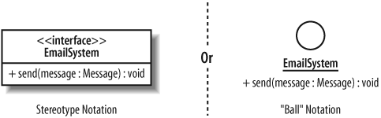

# Unified Modeling Language (UML)

- [¿Qué hay en un lenguaje de modelado?](#-qu--hay-en-un-lenguaje-de-modelado-)
- [Presentación de clases y diagramas de clases](#presentaci-n-de-clases-y-diagramas-de-clases)
  * [¿Qué es una clase?](#-qu--es-una-clase-)
  * [Abstracción](#abstracci-n)
  * [Encapsulación](#encapsulaci-n)
- [Diseñando clases con UML](#dise-ando-clases-con-uml)
  * [Visibilidad](#visibilidad)
    + [Pública](#p-blica)
    + [Protegido](#protegido)
    + [Paquete](#paquete)
    + [Privado](#privado)
  * [Atributos de la clase](#atributos-de-la-clase)
  * [Comportamientos de una clase](#comportamientos-de-una-clase)
  * [Relaciones de clase](#relaciones-de-clase)
    + [Dependencia](#dependencia)
    + [Asociación](#asociaci-n)
    + [Agregación](#agregaci-n)
  * [Composición](#composici-n)
    + [Generalización (*Herencia*)](#generalizaci-n---herencia--)
  * [Clases Abstractas](#clases-abstractas)
    + [Interfaces](#interfaces)
    + [Plantillas](#plantillas)

El lenguaje de modelado unificado (UML) es el lenguaje de modelado estándar para el desarrollo de software y sistemas.

Diseñar sistemas y apliaciones, se hacen diagramas por una razón importante: administrar la complejidad, diagrama ayuda a ver el bosque de los árboles, lo que le permite concentrarse, capturar, documentar y comunicar los aspectos importantes del diseño del sistema antes de que se empiece a desarrollar y codificar.

## ¿Qué hay en un lenguaje de modelado?

Un lenguaje de modelado puede estar compuesto de pseudocódigo, código real, imágenes y diagramas; de hecho, es prácticamente cualquier cosa que te ayude a describir el sistema. Los elementos que forman un lenguaje de modelado se llaman *notación*.

## Presentación de clases y diagramas de clases

Las clases están en el centro de cualquier sistema orientado a objetos; por lo tanto, se deduce que el diagrama UML más popular es el **diagrama de clase**. La estructura de un sistema se compone de una colección de piezas a menudo denominadas objetos. Las clases describen los diferentes tipos de objetos que su sistema puede tener, y los diagramas de clases muestran estas clases y sus relaciones.

### ¿Qué es una clase?

Una **clase** es una plantilla para la creación de [objetos de datos](https://es.wikipedia.org/wiki/Objeto_(programación)) según un modelo predefinido. Las clases se utilizan para representar entidades o conceptos, como los [sustantivos](https://es.wikipedia.org/wiki/Sustantivo) en el lenguaje. Cada clase es un modelo que define un conjunto de [variables](https://es.wikipedia.org/w/index.php?title=Atributos_(programación)&action=edit&redlink=1) -el estado, y [métodos](https://es.wikipedia.org/wiki/Método_(informática)) apropiados para operar con dichos datos -el comportamiento. Cada objeto creado a partir de la clase se denomina [instancia](https://es.wikipedia.org/wiki/Instancia_(informática)) de la clase.

### Abstracción

La definición de una clase contiene los detalles sobre la clase que son importantes para el diseño del sistema. Por ejemplo, *una guitarra* puede tener un rasguño en la parte posterior, o varios, pero si estoy creando una clase que represente *las guitarras*, *¿debo agregar atributos que contengan detalles sobre los rasguños?* Podría si la clase se usara en un taller de reparaciones; sin embargo, si la clase se usara solo en el sistema de fábrica, entonces los rasguños son un detalle que espero ignorar. **Descartar detalles irrelevantes dentro de un contexto dado se llama abstracción.**

La abstracción es clave no solo para los diagramas de clases sino también para el modelado en general. Un modelo, por definición, es una abstracción del sistema que representa. El sistema actual es real; el modelo contiene solo suficiente información para ser una representación precisa del sistema real. En la mayoría de los casos, el modelo abstrae detalles que no son importantes para la precisión de la representación.

### Encapsulación

Antes de analizar más detalladamente los atributos, las operaciones y cómo las clases pueden trabajar juntas, vale la pena centrarse en cuál es la característica más importante de las clases y la orientación a objetos: la encapsulación.

De acuerdo con el enfoque orientado a objetos para el desarrollo del sistema, para que un objeto sea un objeto, necesita contener datos (atributos) y las instrucciones que afectan las operaciones de datos. Esta es la gran diferencia entre la orientación a objetos y otros enfoques para el desarrollo del sistema: en OO, existe el concepto de un objeto que contiene, o encapsula, tanto los datos como las operaciones que trabajan en esos datos.

## Diseñando clases con UML

En su forma más simple, una clase en UML se dibuja como un rectángulo dividido en hasta tres secciones. La sección superior contiene el nombre de la clase, la sección central contiene los atributos o la información que contiene la clase, y la sección final contiene las operaciones que representan el comportamiento que exhibe la clase. Las secciones de atributos y operaciones son opcionales.

### Visibilidad

Una vez que se aplican las características de visibilidad, puede controlar el acceso a atributos, operaciones e incluso clases enteras para aplicar la encapsulación de manera efectiva.

#### Pública

La **visibilidad pública** se especifica utilizando el símbolo más (`+`) antes del atributo u operación asociada. Declare público un atributo u operación si desea que cualquier otra clase pueda acceder a él directamente.

> **ATRIBUTOS PÚBLICOS**
> ¿Tener atributos públicos o no tener atributos públicos? Esa es la pregunta. Muchos diseñadores orientados a objetos se quejan del uso de atributos públicos: abrir los atributos de una clase al resto del sistema es como exponer su casa a cualquier persona fuera de la calle sin requerir que lo consulte con usted antes de ingresar. Existe el mismo potencial de abuso.
>
> Por lo general, **es mejor evitar los atributos públicos**, pero siempre hay excepciones a la regla. Un ejemplo en el que generalmente se acepta el uso de un atributo público es cuando el atributo es una constante que puede ser utilizada por varias clases diferentes.

#### Protegido

Los atributos y las operaciones `protected` se especifican utilizando el símbolo hash (`#`) y son más visibles para el resto de su sistema que los atributos y operaciones privadas, pero son menos visibles que los públicos. Se puede acceder a los elementos protegidos declarados en las clases mediante métodos que son parte de su clase y también mediante métodos que se declaran en cualquier clase que herede de su clase. Una clase que no hereda de su clase no puede acceder a los elementos protegidos, esté en el mismo paquete o no.

#### Paquete

La visibilidad del paquete, especificada con una (`~`), cuando se aplica a atributos y operaciones, se encuentra entre protegida y privada. Como era de esperar, los paquetes son el factor clave para determinar qué clases pueden ver un atributo u operación que se declara con la visibilidad del paquete.

La regla es bastante simple: si agrega un atributo u operación que se declara con visibilidad de paquete a su clase, entonces cualquier clase en el mismo paquete puede acceder directamente a ese atributo u operación. Las clases fuera del paquete no pueden acceder a los atributos u operaciones protegidos, incluso si se trata de una clase heredada. En la práctica, la visibilidad del paquete es más útil cuando desea declarar una colección de métodos y atributos en sus clases que solo se pueden usar dentro de su paquete.

#### Privado

La visibilidad privada es el tipo de clasificación de visibilidad más restringido, y se muestra agregando un símbolo menos (`-`) antes del atributo u operación. Solo la clase que contiene el elemento privado puede ver o trabajar con los datos almacenados en un atributo privado o realizar una llamada a una operación privada.

La visibilidad privada es más útil si tiene un atributo u operación del que no desea que dependa ninguna otra parte del sistema. Este podría ser el caso si tiene la intención de cambiar un atributo u operación más adelante, pero no desea que se modifiquen otras clases con acceso a ese elemento.

### Atributos de la clase

Los atributos de una clase son las piezas de información que representan el estado de un objeto. Estos atributos se pueden representar en un diagrama de clase, ya sea colocándolos dentro de su sección del cuadro de clase, conocidos como atributos en línea, o por asociación con otra clase.

### Comportamientos de una clase

Las operaciones de una clase describen lo que una clase puede hacer pero no necesariamente cómo lo hará. Una operación es más como una promesa o un contrato mínimo que declara que una clase contendrá un comportamiento que hace lo que la operación dice que hará. La recopilación de todas las operaciones que contiene una clase debe abarcar totalmente todo el comportamiento que contiene la clase, incluido todo el trabajo que mantiene los atributos de la clase y posiblemente algún comportamiento adicional que esté estrechamente asociado con la clase.

### Relaciones de clase

La fuerza de una relación de clase se basa en cuán dependientes son las clases involucradas en la relación entre sí. Se dice que dos clases que dependen fuertemente entre sí están estrechamente acopladas; los cambios a una clase probablemente afectarán a la otra clase. **El acoplamiento apretado suele ser, pero no siempre, algo malo; por lo tanto, cuanto más fuerte sea la relación, más cuidadoso debes ser.**

#### Dependencia

Una dependencia entre dos clases declara que una clase necesita saber acerca de otra clase para usar objetos de esa clase. Si la clase `UserInterface` del CMS necesitara trabajar con el objeto de una clase `BlogEntry`, entonces esta dependencia se dibujaría usando la flecha de dependencia.

#### Asociación

Aunque la dependencia simplemente permite que una clase use objetos de otra clase, asociaci una clase funciona con un objeto de otra clase, entonces la relación entre esas clases es un gran candidato para la asociación en lugar de solo una dependencia.

#### Agregación

La agregación es realmente solo una versión más fuerte de asociación y se usa para indicar que una clase realmente posee pero puede compartir objetos de otra clase.

La agregación se muestra usando una punta de flecha de diamante vacía al lado de la clase propietaria.

#### Composición

La composición es una relación aún más fuerte que la agregación, aunque funcionan de manera muy similar. La composición se muestra usando una punta de flecha de diamante cerrada o llena.

#### Generalización (Herencia)

La generalización y la herencia se utilizan para describir una clase que es un tipo de otra clase. Los términos tienen un tipo y se han convertido en una forma aceptada de decidir si una relación entre dos clases es agregación o generalización desde hace muchos años. Si te encuentras declarando que una clase tiene una parte que es un objeto de otra clase, entonces la relación probablemente sea de asociación, agregación o composición. Si te encuentras diciendo que la clase es un tipo de otra clase, entonces podrías considerar usar la generalización en su lugar.

#### Herencia Múltiple

La herencia múltiple, o la generalización múltiple en la terminología oficial de UML, ocurre cuando una clase hereda de dos o más clases primarias.

### Clases Abstractas

A veces, cuando usa la generalización para declarar una clase reutilizable y genérica, no podrá implementar todo el comportamiento que necesita la clase general. Si está implementando una clase de Tienda para almacenar y recuperar los artículos del CMS, es posible que desee indicar que no se sabe exactamente cómo una Tienda almacena y recupera los artículos en este momento y debe dejarse en subclases para decidir.

### Interfaces

Si desea declarar los métodos que deberían implementar las clases concretas, pero no utilizar la abstracción ya que solo tiene una relación de herencia (si está codificando en Java), entonces las interfaces podrían ser la respuesta.

Una interfaz es una colección de operaciones que no tienen implementaciones de métodos correspondientes, muy similar a una clase abstracta que contiene solo métodos abstractos. En algunos lenguajes de implementación de software, como C ++, las interfaces se implementan como clases abstractas que no contienen implementaciones de operaciones. En lenguajes más nuevos, como Java y C #, una interfaz tiene su propia construcción especial.

### Plantillas

Las plantillas son una característica avanzada pero útil de la orientación a objetos. Una plantilla (o clase parametrizada, como a veces se las denomina) es útil cuando desea posponer la decisión sobre con qué clases trabajará una clase. Cuando declara una plantilla, es similar a declarar: “Sé que esta clase tendrá que funcionar con otras clases, pero no sé o necesariamente me importa lo que esas clases realmente terminan siendo. "

------

[Página de Inicio](https://github.com/mikeguzman/EIF201-Progra-I)