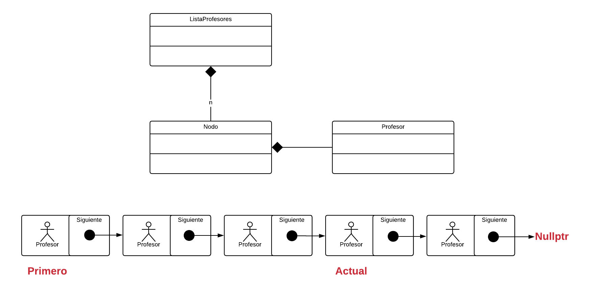

#Listas Simples Enlazadas [Ejercicio Profesor]

El siguiente ejemplo presenta una lista de profesores que se creean automáticamente, usualmente existe una relación de tipo **composición entre la colección y sus nodos**.

